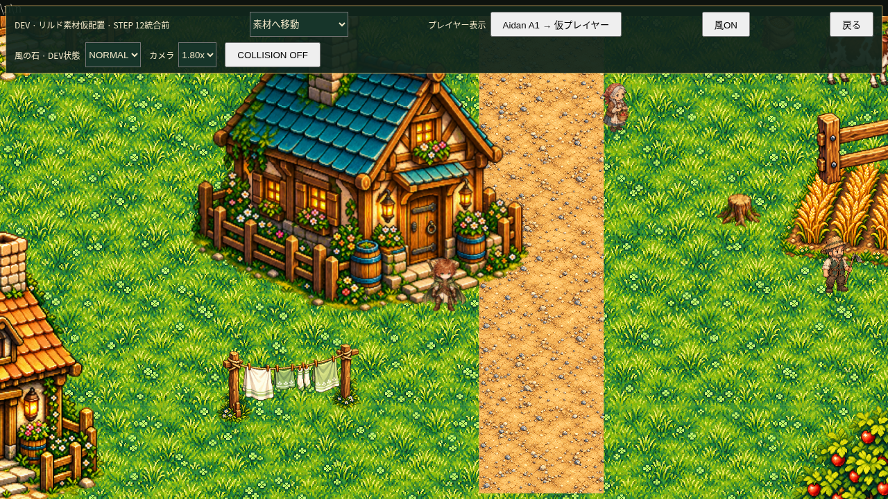
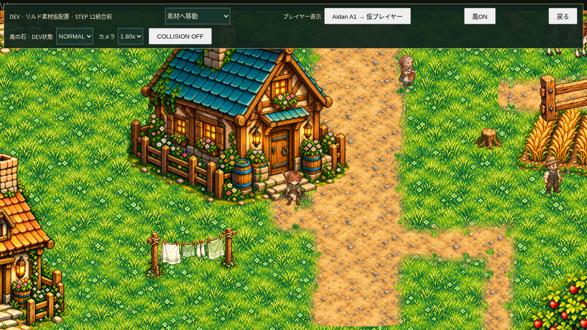
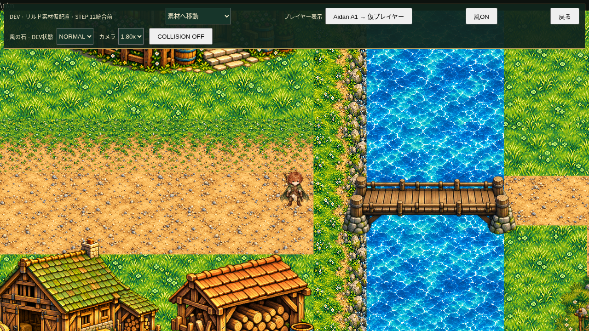
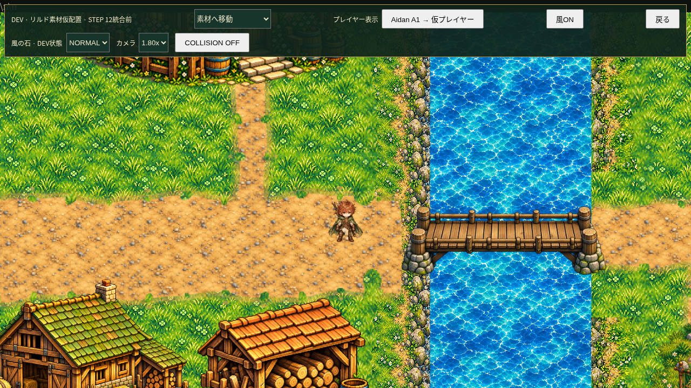
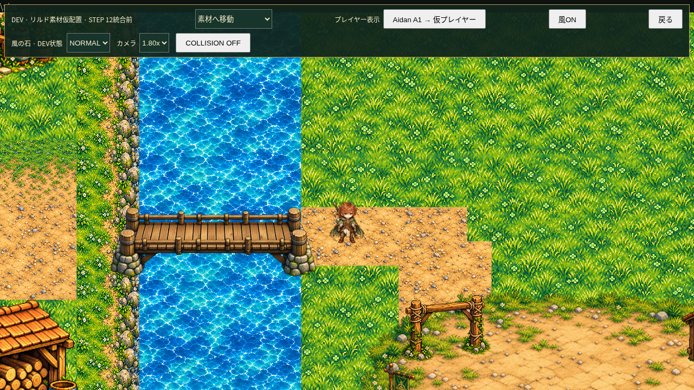
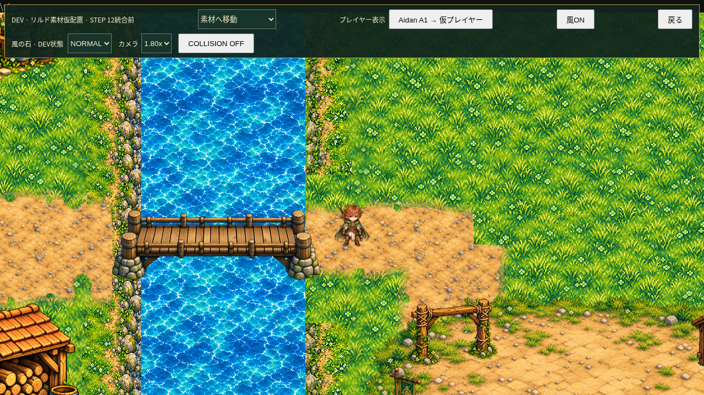
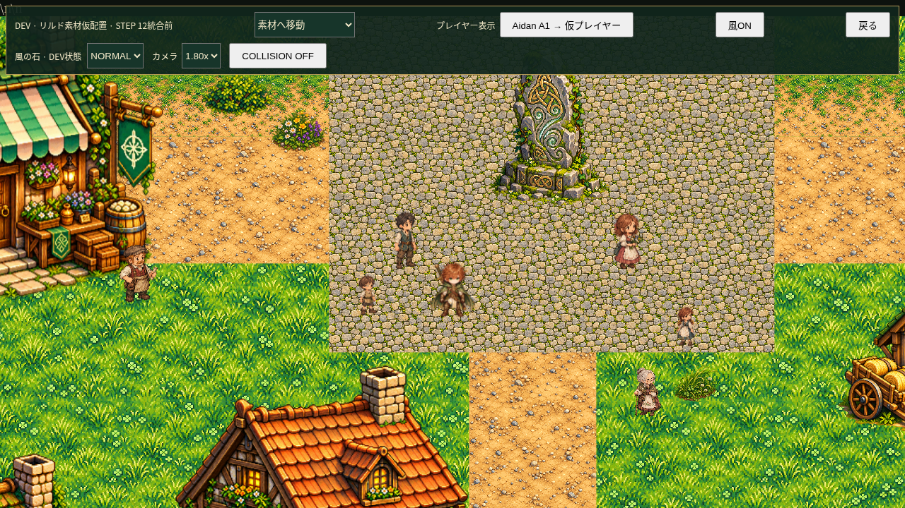
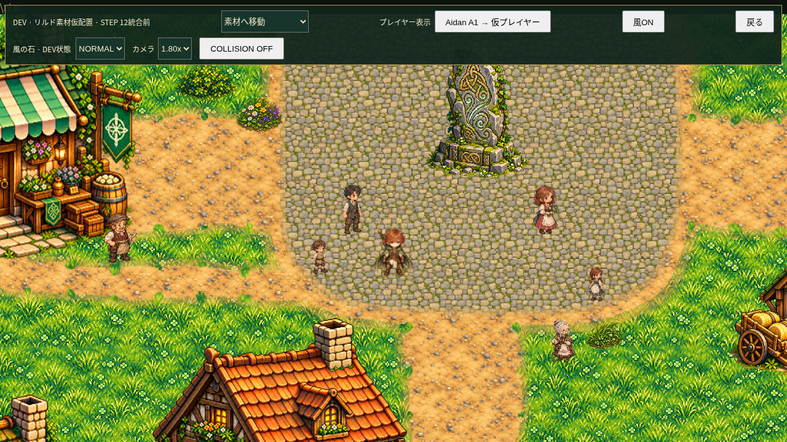
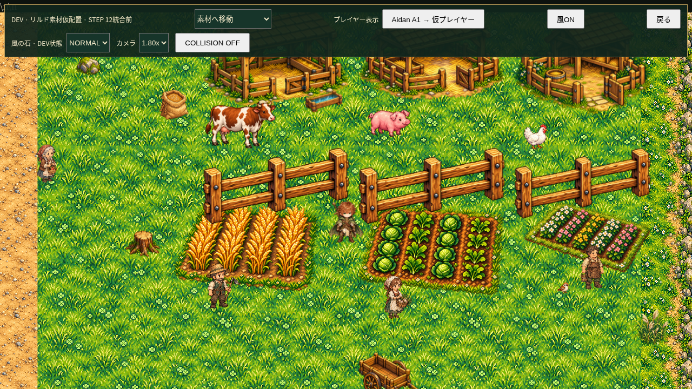
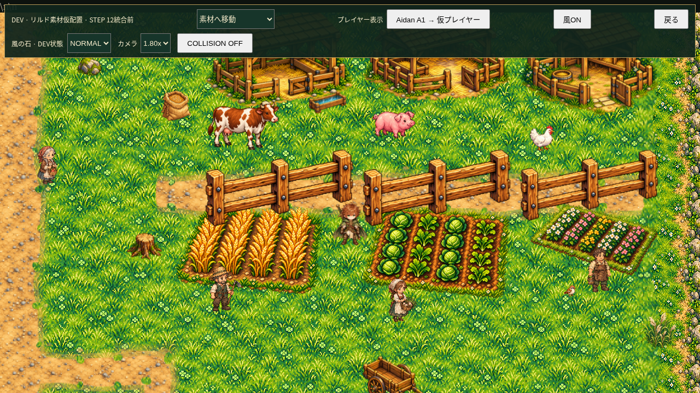

# Lind Visual Polish Step A — Terrain PLAYER QA

**FINAL RESULT: PASS WITH WARNINGS**

開始main: `fc574455ba8403d03df2216f13d32685e94f050f`。
作業branch: `work/lind-visual-polish-terrain`。
**main未統合。GitHub Pagesはmainを公開するため、このTerrain改善は公開Pagesにはまだ反映されません。**
PLAYER QAはこのbranchのHTTP起動版と、下記の比較画像を対象にしてください。

## Root visual cause

GROUNDはcanvas/tilemapではなく、矩形DOMのCSS backgroundによる反復描画でした。
東西・南北の土道、石畳広場、橋東側の接続部を矩形のまま表示し、
草土edge画像は北側の64px帯だけに反復していたため、長い直線・90度角・
異なるテクスチャの四角い配置が強調されていました。
建物PNGの透過縁を再加工する必要はありません。

## Implementation

- `lind-terrain-layout.js`: 村の既存軸・道幅と、意図した踏み跡／作業道の定義。
- `lind-terrain-blend.js`: 既存PNGを使い、透明canvas1枚に静的合成。
- `lind-review.js`: DEV reviewでのみ起動。完成までは旧GROUNDを保持。
- `lind-field-review.css`: canvasを地面に配置、pointer-events:none。
- `index.html`: 上記2scriptの読み込み追加だけ。既存inlineコードは完全一致。

新しいproduction PNGは**0枚**。草256px／土128px／石64pxの既存tile scaleと
既存色調を使用し、元PNGは一切変更していません。縮小時は高品質サンプリングを使い、
canvasの表示は既存fieldと同じpixelatedです。

Macro routeは明確に保ち、両側のmicro edgeに約数pxの凹凸、薄い土の裾、
小さな草の侵食／土の突起を加えます。固定seedで再現可能で、全面ランダム散布ではありません。
南北／東西のedge、曲がり道の内外corner、独立patchを同じ輪郭処理で扱います。
主道路中心は装飾を抑え、DOOR APPROACHと橋の通行帯には草の侵食を入れません。
住宅5地点の玄関接続は既存static solid／川に触れない中心線を確認して描きます。

主道路100px、橋東の横道60px、訓練場へ下る道95pxを維持。
広場の石畳は350×300を基準とした丸い不規則輪郭で土へ接続し、風の石周囲の
周回空間を残しています。農業エリアは限定した細い作業道・踏み跡のみ。
西川岸の草側の継ぎ目をなじませ、東川岸には既存bank素材の乾いた部分のみを使用。
水面にはcanvasの着色ピクセルが**0**で、水のDOM／animation／Collisionは不変です。

## Collision / stable baseline protection

Collision geometry、全object定義、川境界、移動速度、camera defaultは
Before／Afterの4画面で完全一致。`source-protection.json`にhash／値を記録しています。
Aidan footprint22×10、ground anchor(17,42)、既存画像20枚・剣1本を維持。
道を描くためのCollision変更、navigation変更、NPC／家畜AI変更はありません。
Battle JS/CSS/PNGも変更なし。Raider1250／巨大表示／独立HUDを維持しています。

## QA results

| 対象 | 結果 |
|---|---|
| Terrain／草→土／住宅前 | PASS：大きな矩形感を軽減 |
| 広場／子ども用future loop空間 | PASS：視覚準備のみ、AI追加なし |
| 橋西／橋東／農業／石畳／川岸 | PASS |
| 道の視認性／装飾密度 | PASS：中心は明確、縁に限定 |
| 建物Collision | 14棟、44ケース PASS |
| 接触fixture／keyboard接近 | 176サンプル／880接近 PASS |
| 玄関へのmouse／tap | 132経路 PASS |
| wall sliding／corner assist／blocked destination | PASS |
| river／bridge | PASS：水へ侵入不可、橋は通行可能 |
| 橋往復 | 各viewport・scaleでpointerとkeyboard各10往復、計160往復ずつ |
| camera | 1.00／1.50／1.80／2.10 PASS、default1.00不変 |
| PC | 1280×720／1920×1080、browser zoom100% PASS |
| mobile | 844×390／390×844 PASS、**MOBILE EMULATION** |
| Aidan | IDLE4/4、WALK16/16、停止方向復帰／anchor PASS |
| villagers／Emma／birds／livestock | PASS：既存logic不変、家畜600更新でstatic侵入0 |
| Wind Stone／wind OFF／water | PASS：風停止時も水流継続 |
| Battle | COMMAND／攻撃／一閃／防御／敵turn／DEVkill／KO／Victory PASS |
| Raider | HP1250、巨大scale／独立HUD／KO／Victory保護 PASS |
| image404／JS exceptions／console errors | 0／0／0 |
| old embedded／番号asset／旧Lou参照 | 0／0／0 |

Geometry回帰は共通描画導入後に実行。東側の幅を95pxに保持したlayout校正後には、
4画面のvisual、canvas alpha／水面保護、camera／橋10往復を再実行しています。

## Alpha / performance / lifecycle

canvas2200×1550、RGBA buffer13,640,000bytes（約13MiB）。
透明2,849,528pixels／部分透明183,680／不透明376,792。
白黒matteや市松背景を新規合成しません。図柄は既存textureを輪郭で切り抜いたものです。
視覚DOMはcanvas1枚のみ。毎frameのTerrain loopや多数の草DOMは追加していません。
15回reviewを開閉してもcanvas1枚・描画1回で、DOM数／元座標／flags／storageを維持。

計測した初回ready約0.79秒は画像読み込みと一度の合成を含む共有クラウド上の値です。
カメラ移動・風切替時に再合成しません。実機mobileの速度は未測定です。

## Same-position Before / After — camera1.80x, PC1280×720

| 地点 | Before | After |
|---|---|---|
| 住宅前 |  |  |
| 橋西 |  |  |
| 橋東 |  |  |
| 中央広場 |  |  |
| 農業 |  |  |

Mobile evidence: [横・橋東](evidence/after-mobile-844-bridge-east.png)、
[縦・住宅前](evidence/after-mobile-390-house.png)。
画像は実行中のゲーム画面のQA snapshotで、production assetsではありません。

## PLAYER QA / rerun

このbranchを通常のHTTPサーバーで起動し、DEV → リルド村・素材仮配置を開き、
「プレイヤー表示」でAidan A1を選択してください。
カメラ1.00／1.50／1.80／2.10で住宅・広場・農業・橋西東を歩き、必要ならCollision ONで比較。
「風OFF」でも水が流れ続けることも確認してください。mainの公開Pagesは旧Terrainのままです。

再実行はPlaywright／Chromiumと内部HTTP server8015を使用。
`visual-qa.cjs`: `LIND_QA_OUT`／`LIND_QA_PHASE`／`LIND_QA_VIEWS`。
Before flagは旧描画への切替ではありません。Before画像は変更前mainから保存済みです。
`camera-qa.cjs`: `LIND_CAMERA_QA_OUT`／`LIND_QA_VIEWPORTS`。
`collision-qa.cjs`: `FRONT_QA_OUT`／`FRONT_QA_VIEWS`／`FRONT_QA_SCALES`／`FRONT_QA_ONLY`。
`overlay-qa.cjs`: `LIND_QA_OUT`。
既存Aidan／NPC／bird／Battleのrunnerと、このfolderのJSONで個別回帰結果を確認できます。

## Warnings / next work — record only

- 実機mobile未確認。見た目・密度・初回表示の体感はPLAYER QA待ち。
- 既知のDYNAMIC LIVESTOCK INTERFERENCEは不変。今回回避処理を実装していません。
- main統合・Pages公開はPLAYER QA後の承認工程です。

STEP B予定：子どもが風の石周辺を追いかける／交代・逆回り・停止。
一般村人は生活範囲内で2～4歩、停止・方向転換。店員は小さな仕事motion。
高齢NPCとEmmaはidle中心で大きく徘徊しない。動的NPCとauto movementの干渉は別途設計。

STEP C予定：Aidan A1.5、6frame×4方向のWALK候補。髪・マント・身体・脚・
誓いの剣に小さな位相差。既存A1は保存し、上書きしない。

STEP D予定：Fiona FIELD A1。human／ordinary ears、elf耳・翼なし。
light chestnutの長い波打つ髪、green eyes、花／葉飾り、ivory・pale/deep green・gold、
自然／風／回復のstaff。4方向IDLEと6frame×4方向WALK候補。
将来のPARTY FOLLOWは少し遅れて追従し、停止・方向転換を完全同期にしない。
長いCollision詰まり時の安全なrecoveryは別工程。今回どれも生成・実装していません。

## Checkpoints

- Existing-texture layout: `e8f1863a7d43f4982721762a098ac9ba1159af53`
- Terrain implementation: `9009ca4a2a0583c8430b143ddeb31a631f86e2a0`
- East approach width retention: `bb5fa73974ade1439ca86a3fd9ffa6020bb04bc2`
- Regression/evidence: `5499446`（同folderを追加したtest commit）

STEP B、Aidan、Fiona、follow、camera新機能、正式マップ統合には進みません。

LIND VISUAL POLISH STEP A — TERRAIN PLAYER QA READY
